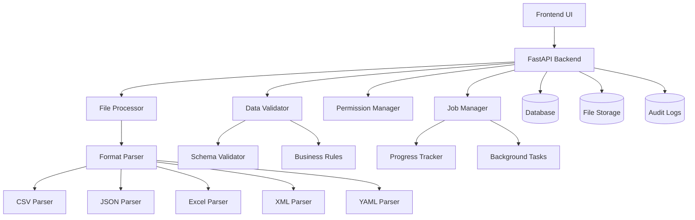

# Import/Export System Guide

## Overview

The FastNext Import/Export system provides comprehensive data management capabilities with enterprise-grade features including multi-format support, validation, permissions, and progress tracking.

## Table of Contents

1. [Features](#features)
2. [Architecture](#architecture)
3. [Getting Started](#getting-started)
4. [Import System](#import-system)
5. [Export System](#export-system)
6. [Security & Permissions](#security--permissions)
7. [API Reference](#api-reference)
8. [Frontend Components](#frontend-components)
9. [Backend Implementation](#backend-implementation)
10. [Configuration](#configuration)
11. [Monitoring](#monitoring)
12. [Troubleshooting](#troubleshooting)

## Features

### 🔄 Import Capabilities
- **Multi-Format Support**: CSV, JSON, Excel (XLSX/XLS), XML, YAML
- **Schema Validation**: Automatic validation against target table schema
- **Field Mapping**: Visual field mapping with transformation options
- **Progress Tracking**: Real-time progress updates for large files
- **Error Handling**: Row-level error reporting with detailed messages
- **Duplicate Management**: Configurable handling (skip, update, error)
- **Batch Processing**: Efficient processing of large datasets
- **Preview Mode**: Preview data before import
- **Approval Workflow**: Optional approval process for imports

### 📤 Export Capabilities
- **Multiple Formats**: CSV, JSON, Excel, XML, YAML export
- **Column Selection**: Choose specific columns to export
- **Data Filtering**: Apply filters before export
- **Large Dataset Support**: Background processing for big exports
- **Template System**: Save and reuse export configurations
- **Download Management**: Secure file downloads with expiration
- **Compression**: Automatic compression for large files
- **Scheduling**: Schedule recurring exports (future feature)

### 🔐 Security Features
- **Permission Control**: Table-level permissions per user
- **File Validation**: Comprehensive file security checks
- **Audit Logging**: Complete audit trail for all operations
- **Rate Limiting**: Prevent abuse with configurable limits
- **Data Sanitization**: Clean input data to prevent injection
- **Access Control**: Role-based access to import/export features

## Architecture

### System Components



### Database Schema

```sql
-- Import Jobs
CREATE TABLE import_jobs (
    id SERIAL PRIMARY KEY,
    job_id VARCHAR(36) UNIQUE NOT NULL,
    table_name VARCHAR(100) NOT NULL,
    status VARCHAR(20) NOT NULL DEFAULT 'PENDING',
    original_filename VARCHAR(500) NOT NULL,
    file_size INTEGER,
    file_format VARCHAR(20) NOT NULL,
    import_options JSON NOT NULL DEFAULT '{}',
    field_mappings JSON NOT NULL DEFAULT '{}',
    progress_percent FLOAT NOT NULL DEFAULT 0.0,
    total_rows INTEGER,
    processed_rows INTEGER NOT NULL DEFAULT 0,
    valid_rows INTEGER NOT NULL DEFAULT 0,
    error_rows INTEGER NOT NULL DEFAULT 0,
    validation_results JSON NOT NULL DEFAULT '{}',
    import_results JSON NOT NULL DEFAULT '{}',
    started_at TIMESTAMP WITH TIME ZONE,
    completed_at TIMESTAMP WITH TIME ZONE,
    error_message TEXT,
    requires_approval BOOLEAN NOT NULL DEFAULT FALSE,
    created_at TIMESTAMP WITH TIME ZONE DEFAULT NOW(),
    updated_at TIMESTAMP WITH TIME ZONE,
    created_by INTEGER REFERENCES users(id)
);

-- Export Jobs
CREATE TABLE export_jobs (
    id SERIAL PRIMARY KEY,
    job_id VARCHAR(36) UNIQUE NOT NULL,
    table_name VARCHAR(100) NOT NULL,
    status VARCHAR(20) NOT NULL DEFAULT 'PENDING',
    export_format VARCHAR(20) NOT NULL,
    export_options JSON NOT NULL DEFAULT '{}',
    selected_columns JSON NOT NULL DEFAULT '[]',
    filters JSON NOT NULL DEFAULT '[]',
    filename VARCHAR(500),
    file_path VARCHAR(1000),
    file_size INTEGER,
    download_url VARCHAR(1000),
    progress_percent FLOAT NOT NULL DEFAULT 0.0,
    estimated_rows INTEGER,
    processed_rows INTEGER NOT NULL DEFAULT 0,
    started_at TIMESTAMP WITH TIME ZONE,
    completed_at TIMESTAMP WITH TIME ZONE,
    error_message TEXT,
    created_at TIMESTAMP WITH TIME ZONE DEFAULT NOW(),
    updated_at TIMESTAMP WITH TIME ZONE,
    created_by INTEGER REFERENCES users(id)
);

-- Import Permissions
CREATE TABLE import_permissions (
    id SERIAL PRIMARY KEY,
    user_id INTEGER NOT NULL REFERENCES users(id),
    table_name VARCHAR(100) NOT NULL,
    can_import BOOLEAN NOT NULL DEFAULT TRUE,
    can_validate BOOLEAN NOT NULL DEFAULT TRUE,
    can_preview BOOLEAN NOT NULL DEFAULT TRUE,
    max_file_size_mb INTEGER NOT NULL DEFAULT 10,
    max_rows_per_import INTEGER NOT NULL DEFAULT 10000,
    allowed_formats JSON NOT NULL DEFAULT '["csv", "json", "excel"]',
    requires_approval BOOLEAN NOT NULL DEFAULT FALSE,
    created_at TIMESTAMP WITH TIME ZONE DEFAULT NOW(),
    updated_at TIMESTAMP WITH TIME ZONE
);

-- Export Permissions
CREATE TABLE export_permissions (
    id SERIAL PRIMARY KEY,
    user_id INTEGER NOT NULL REFERENCES users(id),
    table_name VARCHAR(100) NOT NULL,
    can_export BOOLEAN NOT NULL DEFAULT TRUE,
    can_preview BOOLEAN NOT NULL DEFAULT TRUE,
    max_rows_per_export INTEGER NOT NULL DEFAULT 100000,
    allowed_formats JSON NOT NULL DEFAULT '["csv", "json", "excel"]',
    allowed_columns JSON NOT NULL DEFAULT '[]',
    created_at TIMESTAMP WITH TIME ZONE DEFAULT NOW(),
    updated_at TIMESTAMP WITH TIME ZONE
);
```

## Getting Started

### 1. Setup Demo Data

First, create demo permissions and sample files:

```bash
cd backend
source venv/bin/activate
python create_import_export_demo_data.py
```

This creates:
- Demo permissions for common tables
- Sample CSV files (users, products, orders)
- Sample JSON file (customers)

### 2. Start the Backend

```bash
cd backend
source venv/bin/activate
python main.py
```

The API will be available at `http://localhost:8000` with documentation at `http://localhost:8000/docs`.

### 3. Test the System

Run the integration test:

```bash
python test_import_export_api.py
```

## Import System

### File Upload Process

1. **File Validation**: Check file type, size, and format
2. **Parsing**: Extract data based on file format
3. **Preview**: Show sample data for review
4. **Field Mapping**: Map source columns to target fields
5. **Validation**: Validate data against schema and rules
6. **Processing**: Import data in batches
7. **Completion**: Generate results and audit logs

### Supported Formats

#### CSV Files
```csv
name,email,age,department
John Doe,john@example.com,30,Engineering
Jane Smith,jane@example.com,25,Marketing
```

**Options:**
- Delimiter: comma, semicolon, tab
- Quote character: double quotes, single quotes
- Encoding: UTF-8, ISO-8859-1, Windows-1252
- Headers: first row contains headers
- Skip rows: skip N rows at the beginning

#### JSON Files
```json
{
  "users": [
    {
      "name": "John Doe",
      "email": "john@example.com",
      "age": 30,
      "department": "Engineering"
    }
  ]
}
```

**Supported structures:**
- Array of objects
- Object with array property
- Flat object (converted to single record)

#### Excel Files (.xlsx/.xls)
- Supports multiple worksheets (uses first by default)
- Reads headers from first row
- Handles various data types automatically
- Preserves formatting where applicable

#### XML Files
```xml
<?xml version="1.0"?>
<users>
  <user>
    <name>John Doe</name>
    <email>john@example.com</email>
    <age>30</age>
    <department>Engineering</department>
  </user>
</users>
```

#### YAML Files
```yaml
users:
  - name: John Doe
    email: john@example.com
    age: 30
    department: Engineering
```

### Field Mapping

Map source columns to target database fields:

```typescript
const fieldMappings = [
  {
    sourceColumn: "full_name",
    targetColumn: "name",
    transform: "trim"
  },
  {
    sourceColumn: "email_address", 
    targetColumn: "email",
    transform: "lower"
  },
  {
    sourceColumn: "years_old",
    targetColumn: "age",
    transform: "number"
  }
];
```

**Available Transformations:**
- `trim`: Remove whitespace
- `upper`: Convert to uppercase
- `lower`: Convert to lowercase
- `number`: Convert to number
- `date`: Parse date
- `boolean`: Convert to boolean

### Validation Rules

Built-in validation includes:

- **Required Fields**: Check for null/empty values
- **Data Types**: Validate against column types
- **Unique Constraints**: Check for duplicates
- **Format Validation**: Email, URL, date formats
- **Range Validation**: Min/max values for numbers
- **Custom Rules**: User-defined validation logic

### Error Handling

Errors are reported at multiple levels:

```json
{
  "isValid": false,
  "totalRows": 100,
  "validRows": 85,
  "errorRows": 15,
  "errors": [
    {
      "row": 5,
      "column": "email",
      "field": "email",
      "message": "Invalid email format",
      "severity": "error",
      "value": "invalid-email"
    }
  ],
  "warnings": [
    {
      "row": 10,
      "column": "age",
      "field": "age", 
      "message": "Age seems unusually high",
      "value": 150
    }
  ]
}
```

## Export System

### Export Process

1. **Configuration**: Select table, columns, and filters
2. **Validation**: Check permissions and limits
3. **Processing**: Generate export in background
4. **Download**: Provide secure download link
5. **Cleanup**: Remove files after expiration

### Export Options

```typescript
const exportOptions = {
  format: 'csv',
  columns: ['name', 'email', 'created_at'],
  filters: [
    {
      column: 'status',
      operator: 'equals',
      value: 'active'
    },
    {
      column: 'created_at',
      operator: 'greater_than',
      value: '2023-01-01'
    }
  ],
  includeHeaders: true,
  dateFormat: 'iso',
  delimiter: ',',
  encoding: 'utf-8'
};
```

### Large Dataset Handling

For large exports:

1. **Background Processing**: Exports run in background
2. **Progress Tracking**: Real-time progress updates
3. **Compression**: Automatic file compression
4. **Chunked Download**: Support for resumable downloads
5. **Expiration**: Files expire after configurable time

## Security & Permissions

### Import Permissions

```python
from app.models.data_import_export import ImportPermission

# Create import permission
permission = ImportPermission(
    user_id=user.id,
    table_name="products",
    can_import=True,
    can_validate=True,
    can_preview=True,
    max_file_size_mb=50,
    max_rows_per_import=25000,
    allowed_formats=["csv", "json", "excel"],
    requires_approval=False
)
```

### Export Permissions

```python
from app.models.data_import_export import ExportPermission

# Create export permission
permission = ExportPermission(
    user_id=user.id,
    table_name="users",
    can_export=True,
    can_preview=True,
    max_rows_per_export=50000,
    allowed_formats=["csv", "json", "excel"],
    allowed_columns=["name", "email", "created_at"]  # Restrict sensitive columns
)
```

### Security Measures

1. **File Validation**: Check file types and sizes
2. **Content Scanning**: Scan for malicious content
3. **Data Sanitization**: Clean input data
4. **Permission Checks**: Verify user permissions
5. **Rate Limiting**: Prevent abuse
6. **Audit Logging**: Track all operations
7. **Secure Storage**: Temporary file encryption

## API Reference

### Import Endpoints

#### Upload File
```http
POST /api/v1/data/import/upload
Content-Type: multipart/form-data

Parameters:
- file: Upload file
- table_name: Target table name
- import_options: JSON string with import configuration
- field_mappings: JSON string with field mappings
- requires_approval: Boolean for approval workflow
```

#### Parse File
```http
POST /api/v1/data/import/parse
Content-Type: multipart/form-data

Parameters:
- file: Upload file
- import_options: ImportOptionsSchema
```

#### Validate Data
```http
POST /api/v1/data/import/{job_id}/validate

Response:
{
  "isValid": boolean,
  "totalRows": number,
  "validRows": number,
  "errorRows": number,
  "errors": ValidationError[],
  "warnings": ValidationWarning[]
}
```

#### Start Import
```http
POST /api/v1/data/import/{job_id}/start

Response:
{
  "id": number,
  "job_id": string,
  "status": string,
  "progress_percent": number
}
```

#### Get Status
```http
GET /api/v1/data/import/{job_id}/status

Response:
{
  "id": number,
  "job_id": string,
  "status": string,
  "progress_percent": number,
  "total_rows": number,
  "processed_rows": number,
  "valid_rows": number,
  "error_rows": number,
  "started_at": datetime,
  "completed_at": datetime,
  "error_message": string
}
```

### Export Endpoints

#### Create Export
```http
POST /api/v1/data/export/create
Content-Type: application/json

{
  "table_name": "users",
  "export_format": "csv",
  "selected_columns": ["name", "email"],
  "filters": [],
  "export_options": {
    "include_headers": true,
    "date_format": "iso"
  }
}
```

#### Get Export Status
```http
GET /api/v1/data/export/{job_id}/status

Response:
{
  "id": number,
  "job_id": string,
  "status": string,
  "progress_percent": number,
  "filename": string,
  "file_size": number,
  "download_url": string,
  "expires_at": datetime
}
```

#### Download Export
```http
GET /api/v1/data/export/{job_id}/download

Response: File download
```

## Frontend Components

### DataImport Component

```typescript
import { DataImport } from '@/shared/components/DataImport';

const ImportPage = () => {
  const columns = [
    { key: 'name', label: 'Name', type: 'string', required: true },
    { key: 'email', label: 'Email', type: 'email', required: true },
    { key: 'age', label: 'Age', type: 'number', required: false }
  ];

  const handleImport = async (data, options) => {
    // Handle import logic
  };

  return (
    <DataImport
      tableName="users"
      columns={columns}
      onImport={handleImport}
      maxFileSize={50}
      allowedFormats={['csv', 'json', 'excel']}
      showPreview={true}
      requireValidation={true}
    />
  );
};
```

### DataExport Component

```typescript
import { DataExport } from '@/shared/components/DataExport';

const ExportPage = () => {
  const handleExport = async (options) => {
    // Handle export logic
  };

  return (
    <DataExport
      tableName="users"
      columns={columns}
      onExport={handleExport}
      allowedFormats={['csv', 'json', 'excel']}
      maxRows={100000}
      showPreview={true}
    />
  );
};
```

### Component Props

#### DataImport Props
```typescript
interface ImportComponentProps {
  tableName?: string;
  columns: ImportColumn[];
  onImport?: (data: any[], options: ImportOptions) => Promise<ImportResponse>;
  onValidate?: (data: any[], mappings: FieldMapping[]) => Promise<ValidationResult>;
  onPreview?: (file: File, options: Partial<ImportOptions>) => Promise<ImportPreview>;
  maxFileSize?: number;
  maxRows?: number;
  allowedFormats?: ImportFormat[];
  defaultFormat?: ImportFormat;
  showPreview?: boolean;
  requireValidation?: boolean;
  permissions?: ImportPermission;
  embedded?: boolean;
  className?: string;
}
```

#### DataExport Props
```typescript
interface ExportComponentProps {
  tableName?: string;
  columns: ExportColumn[];
  data?: any[];
  totalRows?: number;
  filters?: ExportFilter[];
  onExport?: (options: ExportOptions) => Promise<ExportResponse>;
  onPreview?: (options: Partial<ExportOptions>) => Promise<ExportPreview>;
  maxRows?: number;
  allowedFormats?: ExportFormat[];
  defaultFormat?: ExportFormat;
  showPreview?: boolean;
  embedded?: boolean;
  className?: string;
}
```

## Backend Implementation

### Data Import Service

```python
from app.utils.data_import import DataImporter

async def import_data(
    file: UploadFile,
    table_name: str,
    field_mappings: List[FieldMappingSchema],
    options: ImportOptionsSchema,
    session: AsyncSession
):
    importer = DataImporter(session)
    
    # Parse file
    parsed_data = await importer.parse_file(file, options)
    
    # Validate data
    validation_result = await importer.validate_data(
        parsed_data["rows"],
        field_mappings,
        table_name
    )
    
    if validation_result.is_valid:
        # Import data
        import_result = await importer.import_data(
            parsed_data["rows"],
            field_mappings,
            table_name,
            options
        )
        return import_result
    else:
        return validation_result
```

### Data Export Service

```python
from app.utils.data_export import DataExporter

async def export_data(
    table_name: str,
    format: ExportFormat,
    columns: List[str],
    filters: List[ExportFilter],
    options: ExportOptions,
    session: AsyncSession
):
    exporter = DataExporter(session)
    
    return await exporter.export_table(
        table_name=table_name,
        format=format,
        filters=filters,
        columns=columns
    )
```

## Configuration

### Environment Variables

```bash
# Import/Export Configuration
IMPORT_MAX_FILE_SIZE=100  # MB
IMPORT_MAX_ROWS=1000000
EXPORT_MAX_ROWS=1000000
EXPORT_FILE_RETENTION_HOURS=24
IMPORT_TEMP_DIR=/tmp/imports
EXPORT_TEMP_DIR=/tmp/exports

# Security
IMPORT_ALLOWED_EXTENSIONS=csv,json,xlsx,xml,yaml
EXPORT_ALLOWED_FORMATS=csv,json,xlsx,xml,yaml
IMPORT_SCAN_CONTENT=true
EXPORT_COMPRESS_LARGE_FILES=true
```

### Application Configuration

```python
# app/core/config.py
class Settings(BaseSettings):
    # Import/Export settings
    IMPORT_MAX_FILE_SIZE: int = 100 * 1024 * 1024  # 100MB
    IMPORT_MAX_ROWS: int = 1000000
    EXPORT_MAX_ROWS: int = 1000000
    EXPORT_FILE_RETENTION_HOURS: int = 24
    
    # Directories
    IMPORT_TEMP_DIR: str = "/tmp/imports"
    EXPORT_TEMP_DIR: str = "/tmp/exports"
    
    # Security
    IMPORT_ALLOWED_EXTENSIONS: List[str] = ["csv", "json", "xlsx", "xml", "yaml"]
    EXPORT_ALLOWED_FORMATS: List[str] = ["csv", "json", "xlsx", "xml", "yaml"]
    IMPORT_SCAN_CONTENT: bool = True
    EXPORT_COMPRESS_LARGE_FILES: bool = True
```

## Monitoring

### Health Checks

```http
GET /api/v1/data/health

Response:
{
  "import_service_status": "healthy",
  "export_service_status": "healthy", 
  "active_import_jobs": 2,
  "active_export_jobs": 1,
  "queue_size": 0,
  "system_load": 0.3,
  "available_storage_gb": 150.5
}
```

### Metrics

Track key metrics:

- **Import Success Rate**: Percentage of successful imports
- **Export Success Rate**: Percentage of successful exports
- **Processing Time**: Average time per operation
- **File Sizes**: Distribution of file sizes
- **Error Rates**: Types and frequency of errors
- **User Activity**: Most active users and tables

### Audit Logs

All operations are logged:

```json
{
  "timestamp": "2023-12-01T10:30:00Z",
  "user_id": 123,
  "operation": "import_started",
  "table_name": "users",
  "job_id": "abc-123-def",
  "details": {
    "filename": "users.csv",
    "file_size": 1024000,
    "estimated_rows": 5000
  },
  "ip_address": "192.168.1.100",
  "user_agent": "Mozilla/5.0..."
}
```

## Troubleshooting

### Common Issues

#### Import Fails with "Permission Denied"
**Solution**: Check import permissions for the user and table:
```sql
SELECT * FROM import_permissions 
WHERE user_id = ? AND table_name = ?;
```

#### File Upload Times Out
**Solutions**:
1. Check file size limits
2. Increase server timeout
3. Use chunked upload for large files

#### Validation Errors
**Solutions**:
1. Check field mappings
2. Verify data types
3. Review validation rules
4. Use preview mode to test

#### Export Takes Too Long
**Solutions**:
1. Add filters to reduce data
2. Select fewer columns
3. Use background processing
4. Check database indexes

### Error Codes

| Code | Description | Solution |
|------|-------------|----------|
| IMPORT_001 | File too large | Reduce file size or increase limit |
| IMPORT_002 | Invalid file format | Use supported format |
| IMPORT_003 | Permission denied | Grant import permission |
| IMPORT_004 | Validation failed | Fix data issues |
| EXPORT_001 | Too many rows | Add filters or increase limit |
| EXPORT_002 | Permission denied | Grant export permission |
| EXPORT_003 | Invalid columns | Check column names |

### Debug Mode

Enable debug logging:

```python
import logging
logging.getLogger('app.utils.data_import').setLevel(logging.DEBUG)
logging.getLogger('app.utils.data_export').setLevel(logging.DEBUG)
```

### Performance Tuning

1. **Database**: Add indexes on commonly filtered columns
2. **File Processing**: Increase chunk sizes for better throughput
3. **Memory**: Monitor memory usage for large files
4. **Storage**: Use SSD storage for temporary files
5. **Network**: Optimize upload/download speeds

### Support

For additional support:
- Check the API documentation at `/docs`
- Review audit logs for detailed error information
- Use debug mode for development
- Contact support with job IDs for specific issues

---

This guide covers the complete Import/Export system. For more specific implementation details, refer to the source code and API documentation.